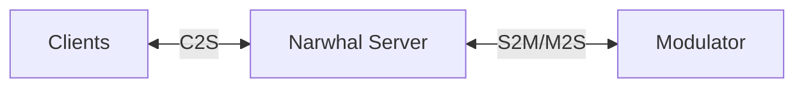

<div align="center"><strong>Narwhal: An extensible pub/sub messaging server for edge applications</strong></div>
<div align="center">
  

[](https://github.com/narwhal-io/narwhal/actions)
[](https://github.com/narwhal-io/narwhal/releases)
[](https://github.com/narwhal-io/narwhal/blob/master/LICENSE)

</div>

## Why Narwhal?
Narwhal was born out of a specific frustration: Building a modern chat feature shouldn't be this hard.

When trying to integrate real-time chat into a startup project, the existing options forced a difficult trade-off:

1. **XMPP (e.g., ejabberd)**: Powerful, but massive complexity, XML overhead, and a steep learning curve for simple needs.

2. **MQTT Brokers**: Lightweight and fast, but rigid. Implementing custom authentication, dynamic permissions, or message validation often requires writing complex broker plugins in C/C++ or wrapping the broker in a "sidecar" mess.

Narwhal is the middle ground. It provides the lightweight performance of an edge broker but delegates the "brains" (Authentication, Authorization, Validation) to your application code via a Modulator.

### What is a Modulator?

A modulator is an external service that implements custom application logic on top of Narwhal's messaging layer. Rather than embedding application-specific features in the server, Narwhal delegates these concerns to a modulator, keeping the core server lightweight and focused on message routing.

Each Narwhal server connects to exactly **one modulator**, ensuring consistent application protocol semantics.

**Common Modulator Use Cases:**

- **Custom Authentication**: JWT validation, OAuth flows, or proprietary auth schemes
- **Authorization & Access Control**: Complex permission rules beyond basic channel ACLs
- **Content Validation**: Message schemas, size limits, or content policies
- **Message Transformation**: Encryption, compression, or message enrichment
- **Business Logic**: Game logic, chat moderation, presence systems
- **Integration**: Bridge with external services, databases, or APIs

## 🎬 Demo

https://github.com/user-attachments/assets/bda491a0-a51b-4aaf-9ec8-3b3e7948d5ce

## Features

- **Designed for Edge Applications**: Built specifically for mobile, desktop, or IoT environments
- **Modular Architecture**: Extend the server with custom application logic via an external modulator
- **Secure by Default**: TLS/SSL support with automatic certificate generation for development
- **Channel Management**: Fine-grained access control and configuration per channel
- **High Performance**: Asynchronous Rust implementation leveraging [io_uring](https://en.wikipedia.org/wiki/Io_uring) for high-throughput ([see benchmark results](docs/BENCHMARK.md))

## 🚀 Quick Start

### Prerequisites

- Rust 1.90 or later
- OpenSSL

### Installation

#### Building from Source

```bash
git clone https://github.com/narwhal-io/narwhal.git
cd narwhal
cargo build --release
```

The compiled binary will be available at `target/release/narwhal`.

#### Running the Server

```bash
# Run with default configuration
cargo run --bin narwhal

# Or with a custom config file
cargo run --bin narwhal -- --config path/to/config.toml
```

### Testing the Connection

Once the server is running, you can test the connection using OpenSSL:

```bash
openssl s_client -connect 127.0.0.1:22622 -ign_eof
```

## Architecture

Narwhal supports three connection types:

1. **Client-to-Server (C2S)**: End-user clients connecting to the Narwhal server
2. **Server-to-Modulator (S2M)**: Server-initiated connection to the modulator for delegating operations
3. **Modulator-to-Server (M2S)**: Modulator-initiated connection for sending private messages to clients



## Configuration

Narwhal uses TOML format for configuration. See the [`examples/config/`](examples/config/) directory for examples.

## Documentation

- **[Protocol Specification](docs/PROTOCOL.md)**: Complete protocol documentation including message formats, flow examples, and wire format details
- **[Benchmark Results](docs/BENCHMARK.md)**: Performance benchmarks and throughput analysis across different payload sizes
- **[Code of Conduct](CODE_OF_CONDUCT.md)**: Community guidelines
- **[Contributing Guide](CONTRIBUTING.md)**: How to contribute to the project

## Examples

The repository includes several example modulators in the [`examples/modulator/`](examples/modulator/) directory:

- **plain-authenticator**: Simple username/password authentication
- **broadcast-payload-json-validator**: Validates JSON message payloads
- **broadcast-payload-csv-validator**: Validates CSV message payloads
- **private-payload-sender**: Demonstrates sending private messages to clients

Each example demonstrates different aspects of building modulators for Narwhal.

## Development

### Project Structure

```
narwhal/
├── crates/
│   ├── benchmark/       # Performance benchmarking tools
│   ├── client/          # Client libraries
│   ├── common/          # Shared types and utilities
│   ├── modulator/       # Modulator client/server implementation
│   ├── protocol/        # Protocol message definitions
│   ├── protocol-macros/ # Protocol code generation macros
│   ├── server/          # Main Narwhal server
│   ├── test-util/       # Testing utilities
│   └── util/            # General utilities
├── docs/                # Documentation
├── examples/            # Example configurations and modulators
└── README.md
```

### Running Tests

```bash
cargo test
```

### Benchmarking Performance

Narwhal includes a benchmark tool to measure throughput and latency performance:

```bash
# Build the benchmark tool
cargo build --bin narwhal-bench --release

# Run a basic benchmark against a local server
./target/release/narwhal-bench \
  --server 127.0.0.1:22622 \
  --producers 1 \
  --consumers 1 \
  --duration 1m \
  --max-payload-size 256
```

The benchmark tool simulates multiple producer and consumer clients connecting to a Narwhal server and exchanging messages. It reports metrics such as:
- Message throughput (messages/second)
- Latency percentiles (p50, p90, p99)
- Connection success rates
- Total messages sent and received

### Running with Debug Tracing

```bash
RUST_LOG=debug cargo run --bin narwhal
```

## Project Status

**Current Version: 0.4.0 (Alpha)**

Narwhal is in active development and currently in **alpha** stage. While the core functionality is working and tested, please note:

- **APIs may change** before reaching 1.0.0 - Breaking changes may occur as we refine the protocol and interfaces based on community feedback
- **Evaluation and development use** - Suitable for testing, proof-of-concepts, and non-production environments
- **Community feedback welcome** - We're actively seeking input to improve Narwhal before stabilizing the 1.0.0 API

If you're interested in using Narwhal in production, we encourage you to get involved, provide feedback, and help shape the future of the project!

## Roadmap

We're actively working on expanding Narwhal's capabilities. Here are some features planned for future releases:

- **Message Persistence**: Durable message storage for reliable message delivery
- **Enhanced Observability**: Built-in metrics, tracing, and monitoring capabilities
- **Performance Optimizations**: Continued improvements to throughput and latency
- **Additional Protocol Transports**: Support for WebSocket and other transport layers
- **Federation Support**: Enable multiple Narwhal servers to communicate and share messages across distributed deployments, allowing for horizontal scaling and multi-region architectures

## Contributing

We welcome contributions! Please see our [Contributing Guide](CONTRIBUTING.md) for details on:

- Reporting bugs
- Suggesting features
- Submitting pull requests
- Development setup

## License

This project is licensed under the BSD-3-Clause License - see the [LICENSE](LICENSE) file for details.

## Community

- **Issues**: [GitHub Issues](https://github.com/narwhal-io/narwhal/issues)
- **Discussions**: [GitHub Discussions](https://github.com/narwhal-io/narwhal/discussions)
