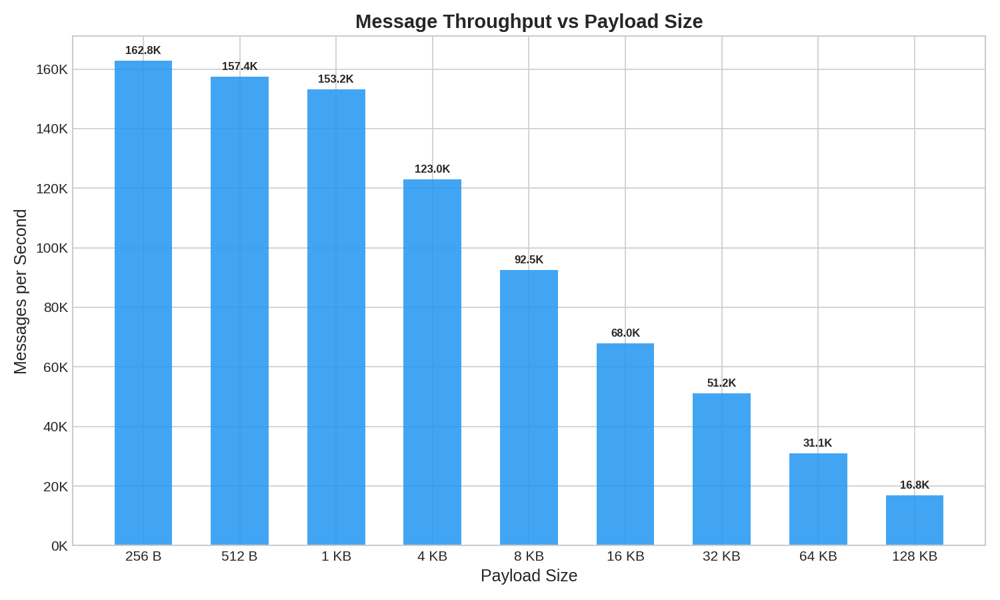
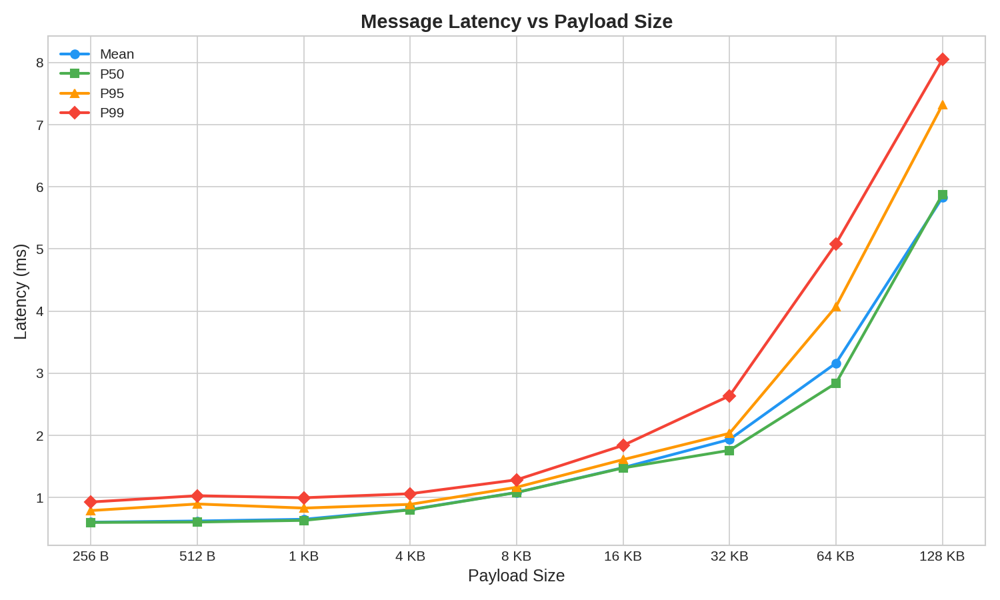
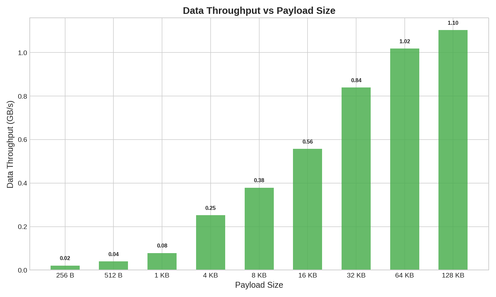

# Benchmark Results

This document contains performance benchmarks for Narwhal's pub/sub messaging system. All benchmarks were conducted using the `narwhal-bench` tool included in the project.

## Test Environment

### Hardware

- **CPU**: Intel(R) Core(TM) Ultra 9 275HX (24 cores)
- **Memory**: 32 GB

### Configuration

- **Build Configuration**: Release mode (`--release`)
- **Server**: Local Narwhal instance (127.0.0.1:22622)
- **Test Duration**: 60 seconds per run
- **Producers**: 1
- **Consumers**: 1
- **Channels**: 1

## Benchmark Tool

The benchmark tool is located in the `crates/benchmark` directory and can be built and run as follows:

```bash
# Build the benchmark tool
cargo build --release -p narwhal-benchmark

# Run a benchmark
./target/release/narwhal-bench \
  --server 127.0.0.1:22622 \
  --producers 1 \
  --consumers 1 \
  --duration 1m \
  --payload-size 256
```

### Available Options

- `-s, --server <ADDR>`: Server address to connect to (default: 127.0.0.1:22622)
- `-p, --producers <N>`: Number of producer clients (default: 1)
- `-c, --consumers <N>`: Number of consumer clients (default: 10)
- `-n, --channels <N>`: Number of channels to create (default: 1)
- `-d, --duration <TIME>`: Duration to run the benchmark (supports: 30s, 5m, 1h)
- `--payload-size <BYTES>`: Size of message payload in bytes (default: 16384)
- `-w, --worker-threads <N>`: Number of worker threads to use (default: 0, auto-detect)

## Results

### Performance Overview Table

All benchmarks were run with 1 producer and 1 consumer for 60 seconds, averaged over 10 runs per payload size.

| Payload Size | Throughput (msg/s) | Data Throughput | Mean Latency | P50 | P95 | P99 | Avg Total Messages | Runs |
|--------------|-------------------:|----------------:|-------------:|----:|----:|----:|-------------------:|-----:|
| 256 B        |            167,474 |       42.9 MB/s |        0.58ms | 0.58ms | 0.77ms | 0.90ms |         10,079,529 | 10/10 |
| 512 B        |            142,951 |       73.2 MB/s |        0.73ms | 0.72ms | 0.95ms | 1.15ms |          8,605,220 | 10/10 |
| 1 KB         |            136,912 |      140.2 MB/s |        0.74ms | 0.71ms | 0.84ms | 0.98ms |          8,245,518 | 10/10 |
| 4 KB         |             91,630 |      375.3 MB/s |        1.10ms | 1.09ms | 1.21ms | 1.32ms |          5,515,447 | 10/10 |
| 8 KB         |             70,099 |      574.2 MB/s |        1.41ms | 1.40ms | 1.59ms | 1.78ms |          4,241,880 | 10/10 |
| 16 KB        |             56,671 |      928.5 MB/s |        1.75ms | 1.64ms | 1.89ms | 2.28ms |          3,424,357 | 10/10 |
| 32 KB        |             29,425 |      964.2 MB/s |        3.40ms | 2.85ms | 3.34ms | 3.94ms |          1,784,276 | 10/10 |
| 64 KB        |             16,648 |       1.09 GB/s |        5.94ms | 4.81ms | 6.72ms | 7.42ms |          1,014,276 | 10/10 |
| 128 KB       |              8,675 |       1.14 GB/s |       11.33ms | 11.82ms | 13.02ms | 18.03ms |            529,619 | 10/10 |

### Visual Performance Analysis

#### Message Throughput



This graph shows how message throughput (messages per second) varies with payload size. Each data point is the average of 10 runs. Peak performance is achieved with 256 B payloads, delivering over 167,000 messages per second on average.

#### Latency



This graph compares Mean, P50, P95, and P99 latency across different payload sizes. Latency scales gradually with payload size, with P99 latency remaining in the single-digit millisecond range even at 128KB payloads.

#### Data Throughput (Bandwidth)



This graph illustrates the actual data throughput. While message rate decreases with larger payloads, the overall bandwidth increases significantly, peaking at 1.14 GB/s with 128 KB payloads.

### Key Observations

1. **Peak Throughput**: Achieved with 256 B payloads at ~167,474 messages/second
2. **Consistent Low Latency**: Sub-1ms mean latency maintained across small payload sizes (256B - 1KB), sub-2ms up to 16KB
3. **Payload Size Impact**: As payload size increases, message throughput decreases while data throughput increases, which is expected due to larger data transfers
4. **Latency Stability**: P99 latency remains low across all payload sizes, indicating consistent performance
5. **Zero Errors**: All benchmarks completed without any message loss or errors
6. **Peak Bandwidth**: 1.14 GB/s achieved at 128 KB payload

## Notes

- All benchmarks were run on a local machine with the server and client on the same host
- Network latency in production environments will add to the observed latency values
- The benchmark tool uses fixed-size payloads as specified by the `--payload-size` flag
- Results may vary based on hardware, OS, and system load
